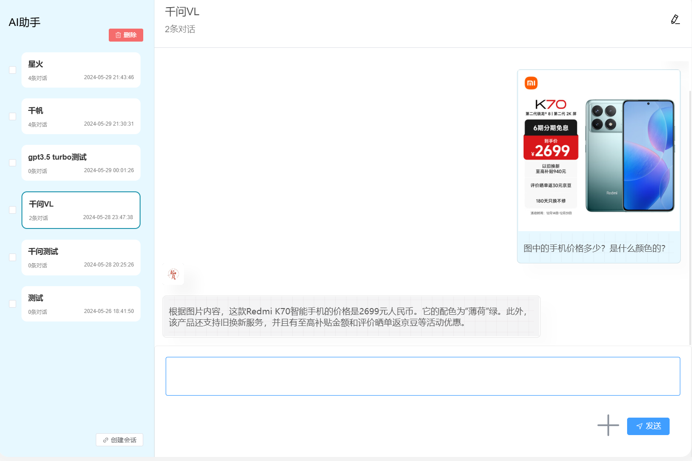
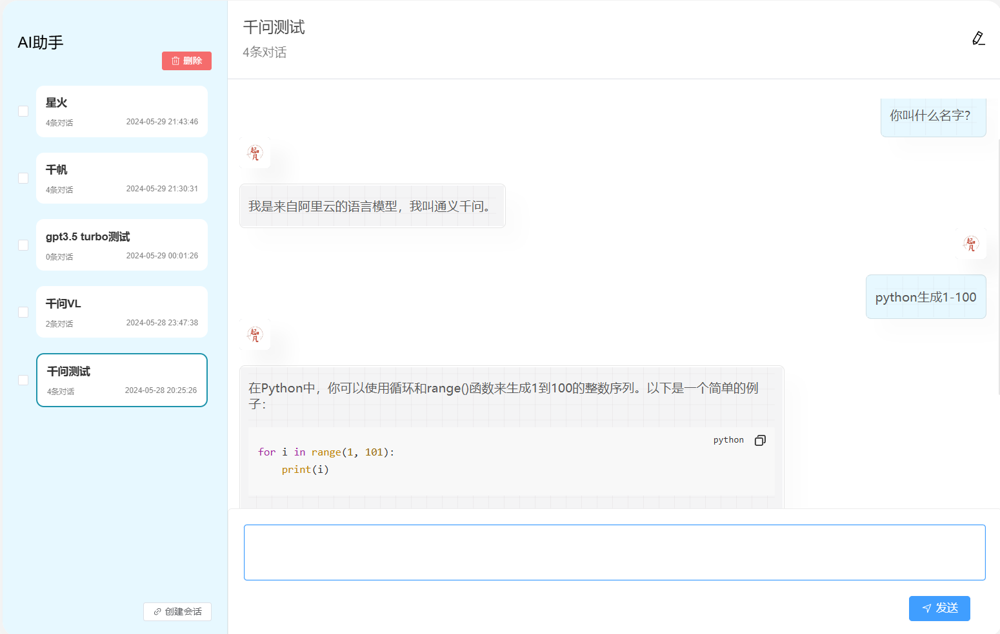
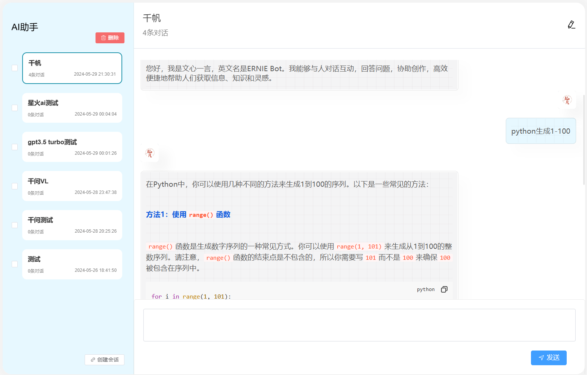

# UNI-AI（AI聚合）

## 项目内容

| 厂家     | 文本对话 | 图片理解 | 图片生成 | 知识库（向量数据库） | 预置角色 |  
|--------|------|------|------|------------|------|
| OpenAI | ✔    | ✔    | 计划中  | 计划中        | 计划中  |
| 阿里灵积   | ✔    | ✔    | 计划中  | 计划中        | 计划中  |
| 百度千帆   | ✔    | ×    | 计划中  | 计划中        | 计划中  |
| 讯飞星火   | ✔    | ×    | 计划中  | 计划中        | 计划中  |
| 智普清言   | 计划中  | 计划中  | 计划中  | 计划中        | 计划中  |

## 项目结构

- uni-ai-admin 聊天界面+后台管理
    - scripts
        - generate-api.js 请求后端生成src/apis下的接口和ts类型
    - src
        - apis 调用后端的接口和接口的ts类型
        - assets 静态资源
        - components 全局通用组件
        - layout 页头/页签管理/左侧树菜单
        - router 路由
        - store 全局级别的状态管理
        - utils 工具
        - typings 通用ts类型
        - views 页面
            - xxx(如: menu)
                - xxx-vuw.vue 入口页面，在router中注册
                - components 页面级别的通用组件
                    - xxx-create-form.vue 创建表单
                    - xxx-update-form.vue 编辑表单
                    - xxx-table.vue 展示表格
                    - xxx-query.vue 查询表单
                    - xxx-dialog.vue 对话框
                - store 页面级别的状态管理，上述几个组件共享store中的变量
        - App.vue 整个项目的入口
        - main.ts vue实例初始化
    - env.development 开发态环境变量
    - env.production 生产态环境变量
    - .eslintrc.js eslint配置
    - .prettierrc.json prettier配置
    - env.d.ts 全局ts类型声明文件
    - package.json npm依赖
    - tsconfig.json ts配置
    - tsconfig.node.json 与打包相关的ts配置，和web开发无关(dev dependencies)
    - tsconfig.app.json web开发相关的ts配置(dependencies)
    - view.config.js vite配置
- uni-ai-server Java服务端
    - buildSrc 通用的依赖和配置，如lombok，springboot依赖
    - common 通用的类
    - generator-core 代码生成器的注解部分
    - generator-processor 代码生成器的实现部分
    - gradle 依赖版本号管理
    - scripts 数据库sql脚本
    - server 后端启动模块
        - src/main
            - dto jimmer的dto文件，可以参考jimmer官方文档
            - java/io.qifan.server
                - ServerApplication 启动类
                - infrastructure 基础设施配置
                - ai ai模块
                    - message 聊天消息
                    - session 聊天会话
                    - model AI模型
                    - role AI角色
                    - tag AI模型标签
                    - uni 各厂家模型统一接口
                - dict 字典管理
                - menu 菜单管理
                - role 角色管理
                - user 用户管理
                - setting token价格配置
                - wallet 钱包计费
    - spring-ai-dashscope-spring-boot-stater 阿里灵积AI
    - spring-ai-qianfan-spring-boot-stater 百度千帆AI
    - spring-ai-spark-spring-boot-stater 讯飞星火AI
    - spring-boot-starter-oss 阿里云oss，腾讯云oss，nginx静态文件服务
    - spring-boot-starter-sms 短信发送服务，阿里云短信，控制台短信测试
    - spring-boot-starter-security SaToken配置

## 技术栈

### 管理端

| 技术             | 说明                                                                | 官网                                     |
|----------------|-------------------------------------------------------------------|----------------------------------------|
| Vite           | 开箱即用的现代前端打包工具                                                     | <https://cn.vitejs.dev/>               |
| Vue3           | Vue 基于标准 HTML 拓展了一套模板语法。Vue 会自动跟踪 JavaScript 状态并在其发生变化时响应式地更新 DOM | <https://cn.vuejs.org/>                |
| Vue Router     | Vue官方路由管理框架                                                       | <https://router.vuejs.org/>            |
| ElementUI Plus | 支持TypeScript提示的Vue3前端UI框架                                         | <https://element-plus.gitee.io/zh-CN/> |
| Pinia          | 全局状态管理框架，支持TypeScript类型提示                                         | <https://pinia.web3doc.top/>           |
| TypeScript     | 让 JS 具备类型声明                                                       | <https://www.typescriptlang.org/>      |
| ESLint         | 语法校验和格式整理                                                         | <https://eslint.org/>                  |
| DayJS          | 日期取值/赋值/运算等操作                                                     | <https://dayjs.fenxianglu.cn/>         |
| LodashJs       | JS各种常用的工具方法                                                       | <https://www.lodashjs.com/>            |
| SSE.js         | SSE流式请求                                                           |                                        |
| md-editor-v3   | markdown语法解析                                                      |                                        |

### 服务端

以我做过三十多个项目和实际工作的经验来说，实际上大部分的需求都是增删改查，我前三年的所有项目的ORM框架都是选用`MyBatis（Plus）`
。每次写动态查询、多表查询、字段映射、字段修改（增加/删除/修改）都需要耗费很多精力去修改Mapper。特别是当需求比较多时，大量的时间被这种无聊地增删改查SQL占用，写代码就变得很无趣。

最近我发现了一个国产的ORM框架`Jimmer`，它和不仅有Mybatis的灵活也有JPA的简便，非常适合自己开发项目。

| 技术             | 说明                                                                             | 官网                                                                                     |
|----------------|--------------------------------------------------------------------------------|----------------------------------------------------------------------------------------|
| SpringBoot3    | Web应用开发框架，需要JDK17及以上版本                                                         | [SpringBoot](https://spring.io/projects/spring-boot)                                   |
| SpringAi       | 统一AI的聊天模型，embedding模型，向量数据库的入参模型等等                                             | [SpringAI](https://docs.spring.io/spring-ai/reference/api/index.html)                  |
| SaToken        | 一个轻量级 Java 权限认证框架，主要解决：登录认证、权限认证、单点登录、OAuth2.0、分布式Session会话、微服务网关鉴权 等一系列权限相关问题 | [SaToken](https://sa-token.cc/)                                                        |
| Jimmer         | 不仅有Mybatis的灵活性也有Hibernate的复用性                                                  | [Jimmer](https://babyfish-ct.gitee.io/jimmer-doc/)                                     |
| QiFanGenerator | 自己写的代码生成器，快速生成前后端增删改查。                                                         | 无官网，在代码里面参考`@GenEentity`和`@GenField`就两个注解就行了                                           |
| 阿里云OSS         | 存储图片，学习用途基本上免费。                                                                | [对象存储 OSS-阿里云帮助中心 (aliyun.com)](https://help.aliyun.com/zh/oss/)                       |
| 微信小程序服务端API    | 用户登录，订阅消息等接口                                                                   | [微信开放文档 (qq.com)](https://developers.weixin.qq.com/miniprogram/dev/OpenApiDoc/)        |
| 微信支付V3         | 用户支付订单                                                                         | [微信支付开发者文档 (qq.com)](https://pay.weixin.qq.com/wiki/doc/apiv3/wxpay/pages/index.shtml) |
| gradle         | 本项目有许多模块，gradle起来比较方便                                                          |                                                                                        |

### 小程序端

小程序端规划中

## 项目运行

### 服务端运行步骤

1. 导入mysql，并修改配置文件的mysql密码。scripts/database.sql
2. 修改各个服务商的的key。application.yml
3. 修改阿里云oss的key。application.yml
4. 下载jdk17
5. 下载redis，并启动
6. 启动server/src/main/java/io/qifan/server/ServerApplication.java

### 管理端运行步骤

1. 执行npm run admin-api
2. 执行npm run dev
3. 登录11111111111 123456

## 联系方式

商务合作：ljc66max(微信)
交流群：416765656